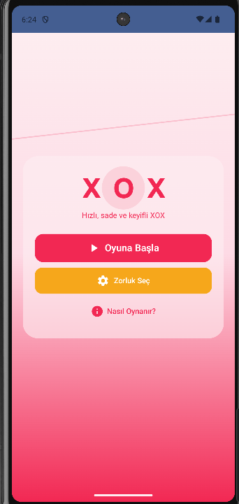
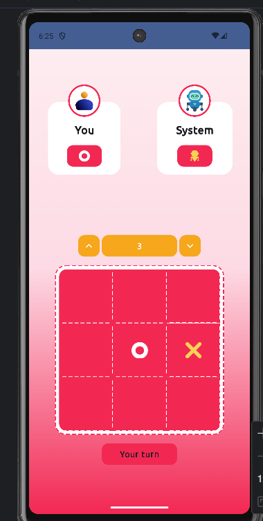
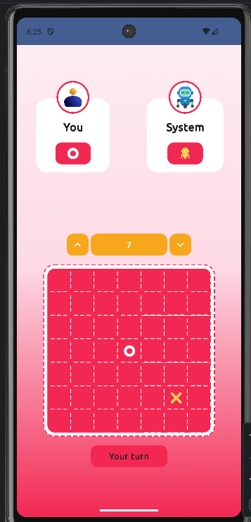

# XOX Game – Jetpack Compose

Basit bir XOX (Tic-Tac-Toe) oyunu.  
Jetpack Compose ile **UI bileşenlerini daha iyi anlamak** ve **MVVM mimarisini uygulamak** amacıyla geliştirildi.

## Özellikler
- MVVM mimarisi
- Jetpack Compose UI
- Ana menü ekranı
- Zorluk seçme özelliği
- Tema renkleri ve animasyonlu arka plan
- Navigation Compose ile ekran geçişleri

## Ekran Görüntüleri

  
 

## 🛠️ Kullanılan Teknolojiler
- **Kotlin**
- **Jetpack Compose**
- **Material 3**
- **Navigation Compose**
- **Hilt (Dependency Injection)**

